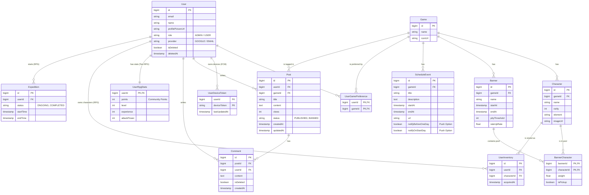

# Gacha Scheduler Database ERD

본 문서는 가챠 스케줄러 앱의 전체 데이터베이스 스키마와 엔티티 간의 관계를 나타내는 ERD입니다. (최근에 추가된 텍스트 RPG, 푸시 알림 엔티티 포함)

## 스키마 주요 설명

1. **Gacha System (가챠 시스템):** `Banner`와 `Character`는 M:N 관계이며, 이를 `BannerCharacter` 엔티티가 매핑합니다. 이때 `BannerCharacter` 테이블에 가중치(weight)와 픽업 여부(isPickup)가 저장되어 유동적인 확률 계산이 가능합니다.
2. **Push Notifications (푸시 알림):** `UserGamePreference`를 구독 카테고리로 활용하며, 매일 스케줄러가 `ScheduleEvent`의 시작일을 체크하여 `UserDeviceToken`을 통해 알림을 발송합니다.
3. **Text RPG (게이미피케이션):** 시뮬레이터에서 뽑은 캐릭터는 `UserInventory`에 쌓이며, 이를 기반으로 `Expedition` 테이블을 생성하여 방치형 탐험 데이터를 추적합니다. 커뮤니티 활동(Post, Comment) 시 `UserRpgStats`의 points(재화)가 증가합니다.
