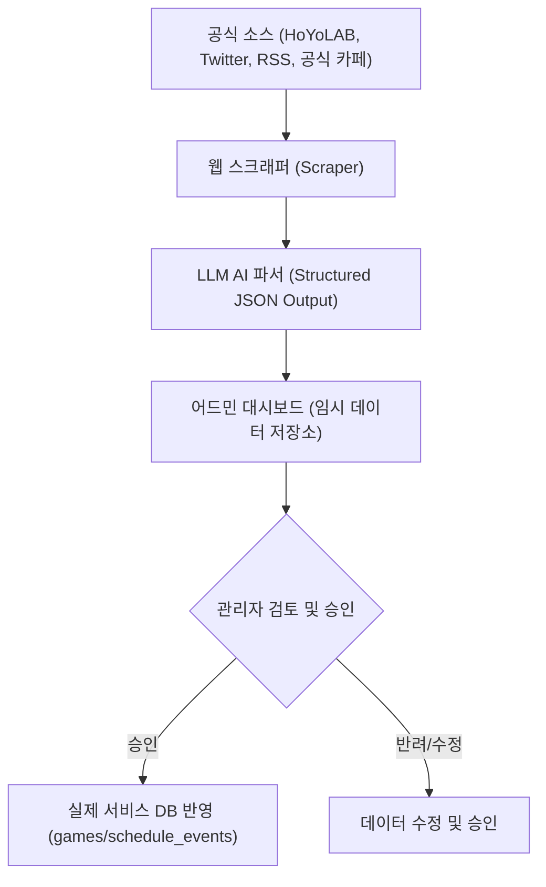

# Phase 4-5 확장 기능 상세 기획서

본 문서는 **Gacha Scheduler** 프로젝트의 장기 로드맵에 따른 고도화 기능(가챠 확률 계산기, 캘린더 연동, 가챠 공유 카드 생성, AI 스케줄 파이프라인)의 요구사항과 아키텍처 및 상세 기획을 다룹니다.

---

## 1. 몬테카를로 기반 가챠 확률 계산기 (Monte Carlo Gacha Calculator)

### 1.1. 기획 배경
기존 가챠 시뮬레이터가 일회성의 뽑기 재미를 제공한다면, 이 기능은 유저가 보유한 재화로 원하는 목표(예: 특정 캐릭터 명함 + 전용 무기)를 달성할 수 있는 통계적 확률을 미리 보여주어 **합리적인 소비 및 재화 저축 계획**을 세울 수 있도록 돕습니다.

### 1.2. 상세 요구사항
*   **유저 입력 항목**:
    *   **보유 재화**: 성약의 돌/원석 수량, 뽑기권(티켓) 개수
    *   **목표 선택**: 대상 캐릭터/무기, 목표 돌파 수치 (명함, 1돌, 2돌 ... 풀돌)
    *   **현재 상태(천장 스택)**: 현재 스택(pity), 반천장 여부(다음 5성 픽업 확정 여부), 무기 배너의 경우 운명 포인트(Fate Points) 상태
*   **연산 엔진**:
    *   사용자가 입력한 가중치와 천장 소프트 피티(Soft Pity, 특정 횟수 이후 확률 증가) 모델을 기반으로 10,000회 모의 뽑기를 백그라운드에서 시뮬레이션합니다.
    *   연산 속도와 서버 리소스 절감을 위해 프론트엔드 **Web Worker**를 활용한 클라이언트 사이드 연산을 수행하거나, 계산 결과가 복잡할 시 전용 백엔드 예측 API를 기획합니다.
*   **UI/UX 및 시각화**:
    *   **확률 밀도 그래프(Line Chart)**: 몇 번의 시도에서 가장 많은 성공이 분포하는지 표시.
    *   **누적 성공 확률(Cumulative Probability)**: "현재 재화로 성공할 확률은 **82%** 입니다"와 같이 직관적인 단일 확률 수치 및 백분율 제공.
    *   **안전선 제언**: "성공률 95% 이상을 달성하기 위해 추가로 필요한 원석은 **4,800개** 입니다" 등의 텍스트 가이드라인 노출.

---

## 2. 캘린더 외부 구독 연동 (iCal / ICS Calendar Subscription)

### 2.1. 기획 배경
유저가 서비스 웹/앱에 접속하지 않아도 본인의 메인 캘린더(구글 캘린더, 애플 캘린더, 아웃룩 등)에서 게임 일정 및 점검, 가챠 일정을 실시간으로 받아볼 수 있는 편의성을 제공합니다.

### 2.2. 아키텍처 및 API 설계
*   **고유 구독 URL 발급**:
    *   로그인한 유저는 마이페이지에서 고유한 ICS 피드 링크를 발급받을 수 있습니다.
    *   형식: `https://gacha-scheduler.com/api/users/{userCode}/calendar.ics`
    *   `userCode`를 난수화하여 타인에게 본인의 계정 정보가 노출되지 않도록 하며, 유출 시 재발급(Reset) 기능을 제공합니다.
*   **동적 iCal 파일 생성**:
    *   백엔드는 해당 API 호출 시, 유저의 게임 관심 필터(`UserGamePreference`) 목록을 조회합니다.
    *   해당 게임들의 활성화된 스케줄(`ScheduleEvent`)을 조회하여 표준 iCalendar(RFC 5545) 규격 텍스트로 변환해 응답합니다.
    *   MIME Type: `text/calendar; charset=utf-8`
*   **캘린더 이벤트 매핑 규칙**:
    *   `SUMMARY`: `[{게임명}] {일정 제목}`
    *   `DESCRIPTION`: 일정 상세 설명 및 공략글/시뮬레이터 바로가기 링크 추가.
    *   `DTSTART` / `DTEND`: 일시 매핑 (업데이트/이벤트는 기간으로 설정, 점검은 특정 시간대로 설정).

---

## 3. 가챠 결과 공유 카드 생성기 (Share Card Generator)

### 3.1. 기획 배경
유저들이 가챠 시뮬레이터에서 획득한 대박(비틱) 결과나 독특한 뽑기 기록을 SNS(특히 Twitter/X)에 자랑하고 싶어 하는 심리를 자극하여 서비스를 자연스럽게 홍보합니다.

### 3.2. 상세 요구사항
*   **공유 템플릿 제공**:
    *   기본 가챠 결과 테이블 외에, 획득한 5성 캐릭터의 공식 일러스트(또는 아이콘)와 유저명, 획득에 걸린 총 뽑기 횟수 등이 표시되는 3~4종의 디자인 템플릿(Glassmorphism, Neon Cyberpunk, Classic Gold 등)을 제공합니다.
*   **이미지 렌더링 방식 (HTML to Canvas)**:
    *   서버의 리소스 및 폰트 라이선스 문제를 방지하기 위해 프론트엔드에서 `html2canvas` 라이브러리를 사용해 브라우저 DOM을 클라이언트 사이드에서 즉시 PNG/JPEG 이미지로 변환합니다.
*   **SNS 공유 인프라**:
    *   모바일 환경(Capacitor 셸)에서는 네이티브 공유 API(`Navigator.share`)를 활성화하여 트위터, 카카오톡, 라인 등으로 이미지와 플랫폼 링크를 함께 전송합니다.
    *   웹 환경에서는 클립보드 복사 및 즉시 다운로드 버튼을 지원합니다.

---

## 4. AI 기반 스케줄 자동 파싱 파이프라인 (AI Scheduler Pipeline)

### 4.1. 기획 배경
수많은 서브컬처 게임의 공지사항과 점검 시간, 가챠 일정을 어드민이 수동으로 입력하는 한계를 극복하고, 휴먼 에러를 방지하여 실시간성을 보장하기 위함입니다.

### 4.2. 파이프라인 아키텍처


### 4.3. 상세 요구사항
*   **데이터 스크래핑**:
    *   각 게임사의 공식 웹사이트 공지사항 RSS, HoYoLAB 공식 계정 포스트, 공식 X(트위터) 계정의 최신 피드를 정기적으로 크롤링(매 3시간마다 실행)합니다.
*   **AI 정형화 (JSON Parsing)**:
    *   스크래핑된 텍스트 본문을 LLM API(예: Gemini Flash)에 전달하여 정형화된 JSON 데이터로 파싱합니다.
    *   **Prompt Schema**:
        ```json
        {
          "gameCode": "genshin",
          "title": "5.4 버전 업데이트 점검 공지",
          "category": "MAINTENANCE",
          "startAt": "2026-07-15T06:00:00+09:00",
          "endAt": "2026-07-15T11:00:00+09:00",
          "description": "업데이트 점검 상세 내용 요약..."
        }
        ```
*   **컨펌 관리 시스템 (Admin Approval System)**:
    *   AI가 파싱한 데이터는 즉시 서비스에 노출되지 않고, 백오피스 대시보드의 **"승인 대기 스케줄"** 목록으로 들어갑니다.
    *   관리자는 알림을 받고 들어가 AI가 파싱한 결과의 오타나 날짜 오류가 없는지 최종 확인(Confirm)한 뒤 1클릭으로 반영합니다.
